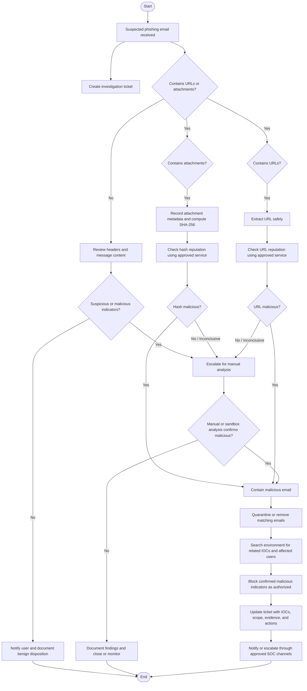

# Phishing Playbook

> **SOC Analyst Portfolio Project** — A practical incident-response playbook for triaging, investigating, containing, and documenting suspected phishing emails.

## Phishing Investigation Flowchart



## Overview

This playbook documents a repeatable Security Operations Center (SOC) workflow for responding to suspected phishing emails. It demonstrates how a security analyst can move from initial alert intake through indicator analysis, manual investigation, containment, user notification, and incident documentation.

**Portfolio note:** This repository is a lab/portfolio demonstration of SOC methodology. It should be adapted to an organization's approved tools, policies, escalation paths, and evidence-retention requirements before production use.

## Objectives

- Triage suspected phishing emails consistently.
- Identify malicious URLs and attachments.
- Extract and investigate indicators of compromise (IOCs).
- Determine whether an email is benign, suspicious, or malicious.
- Contain confirmed threats and reduce exposure.
- Document investigation findings for escalation and future detection.

## Typical Analyst Toolset

| Function | Example Tool / Technique |
|---|---|
| Case management | SIEM/SOAR or ticketing platform |
| URL reputation | VirusTotal or approved reputation service |
| File reputation | SHA-256 hash lookup in VirusTotal or approved service |
| Header analysis | Raw email headers / mail-security console |
| File analysis | Isolated sandbox / approved malware-analysis environment |
| IOC search | SIEM, EDR, email-security platform, proxy/DNS logs |
| Communication | Approved SOC incident and user-notification channels |

> **Operational safety:** Do not open suspicious links or attachments on a normal workstation. Use approved isolated analysis systems. Avoid uploading confidential files to public third-party services; hash lookup or an approved private analysis service may be required by policy.

## Investigation Workflow

### 1. Alert Intake

A suspected phishing email is reported by a user or detected by a security control.

Record the initial case details:

- Reporter and affected mailbox
- Sender address and display name
- Recipient(s)
- Subject
- Message timestamp
- Message ID, if available
- Detection/report source
- Initial reason for suspicion

Create an investigation ticket and preserve relevant evidence according to organizational policy.

### 2. Determine Whether the Email Contains URLs or Attachments

Inspect the message without interacting with potentially malicious content.

**If neither URLs nor attachments are present:** continue with header/content analysis and determine whether the message represents impersonation, social engineering, business email compromise, spam, or a benign message. Notify the user through approved channels when appropriate and document the disposition.

**If URLs or attachments are present:** branch into the applicable investigation paths below. An email can require both paths.

### 3. Attachment Investigation

For each attachment:

1. Record the filename, extension, MIME/file type, and size.
2. Calculate a cryptographic hash, preferably SHA-256.
3. Search the hash using an approved reputation/intelligence source.
4. Record detection results and relevant IOC information.
5. If reputation is inconclusive, analyze the file only in an approved isolated sandbox when permitted.

Example hash commands for a lab environment:

```bash
# Linux
sha256sum suspicious-file

# PowerShell
Get-FileHash .\suspicious-file -Algorithm SHA256
```

A reputation result alone should not be treated as definitive. Consider file behavior, source, prevalence, signatures, context, and corroborating telemetry.

### 4. URL Investigation

For each URL:

1. Extract the URL as text without browsing to it from the analyst workstation.
2. Record the full URL and domain.
3. Check it using approved URL reputation/intelligence services.
4. Examine redirects, domain age/reputation when available, hostname patterns, and destination context.
5. Search enterprise proxy, DNS, EDR, or SIEM telemetry for user interaction where available.

Potential warning signs include credential-harvesting pages, brand impersonation, suspicious redirects, newly observed infrastructure, mismatched link text and destinations, or corroborating threat-intelligence detections.

### 5. Email and Header Analysis

Regardless of attachment/URL results, examine the message itself:

- `From`, `Reply-To`, `Return-Path`, and envelope sender
- SPF, DKIM, and DMARC results
- Received-header path and originating infrastructure
- Look-alike or typo-squatted domains
- Display-name impersonation
- Unexpected requests for credentials, payments, MFA codes, or sensitive information
- Urgency, unusual context, and inconsistent branding

Authentication failures can increase suspicion but are not sufficient by themselves to prove malicious intent. Likewise, passing authentication does not guarantee that a message is safe.

### 6. Manual Analysis / Sandbox

If automated checks are inconclusive, perform controlled manual analysis using an approved isolated environment.

Investigate:

- Redirect chains and landing-page behavior
- Credential collection attempts
- Attachment execution behavior
- Child processes and persistence activity
- Network connections and contacted infrastructure
- Dropped files
- Observable IOCs

Do not submit real credentials or sensitive organizational information during testing.

## Decision and Response

### Benign / False Positive

If evidence supports a benign determination:

- Document the evidence supporting the disposition.
- Close or resolve the investigation according to procedure.
- Notify the reporter when appropriate.
- Avoid unnecessary blocking based solely on weak or ambiguous signals.

### Suspicious / Inconclusive

If evidence remains inconclusive:

- Preserve the message and collected evidence.
- Escalate according to SOC procedures.
- Add relevant observables to monitoring where appropriate.
- Continue threat-intelligence and environment searches.

### Confirmed Malicious

If the email is confirmed malicious, follow authorized containment procedures. Depending on organizational tooling and policy, actions may include:

- Quarantine or remove matching messages from affected mailboxes.
- Block malicious domains, URLs, hashes, or sender infrastructure where appropriate.
- Search for additional recipients and related messages.
- Identify users who clicked links, opened attachments, or submitted credentials.
- Escalate affected endpoints/accounts for additional investigation.
- Reset credentials or revoke sessions when compromise is confirmed or organizational procedure requires it.
- Update the investigation ticket with IOCs, scope, actions, and evidence.

## IOC Documentation

Use a consistent structure when recording indicators:

| IOC Type | Value | Source | Assessment | Action |
|---|---|---|---|---|
| Sender | `example@domain.tld` | Email | Pending | Investigate |
| Domain | `example.tld` | URL | Pending | Reputation check |
| URL | `hxxps://example[.]tld/path` | Email | Pending | Analyze safely |
| SHA-256 | `<hash>` | Attachment | Pending | Reputation lookup |
| IP | `<address>` | Headers/logs | Pending | Search telemetry |

Defang malicious URLs/domains in human-readable reports when appropriate to reduce accidental clicks.

## Example Incident Ticket

```text
Incident Type: Suspected Phishing
Severity: TBD according to organizational criteria
Source: User Report / Email Security Alert

Summary:
A suspicious email was reported for analysis. The message contained a URL and/or attachment requiring reputation and contextual investigation.

Analysis:
- Reviewed sender and email authentication information.
- Extracted URLs and attachment metadata safely.
- Calculated SHA-256 for relevant attachment(s).
- Performed approved reputation checks.
- Searched available security telemetry for related activity.
- Conducted isolated manual analysis when required.

Indicators:
- Sender:
- Domain:
- URL:
- SHA-256:
- IP Address:

User Interaction:
- Link clicked: Yes / No / Unknown
- Attachment opened: Yes / No / Unknown
- Credentials entered: Yes / No / Unknown

Disposition:
Benign / Suspicious / Malicious

Containment / Response:
- Actions taken:
- Additional affected users/assets:
- Escalation:

Analyst Notes:
Document the evidence supporting the disposition and any recommended follow-up.
```

## MITRE ATT&CK Context

Depending on observed behavior, phishing investigations can relate to techniques such as **T1566 – Phishing**, including spearphishing attachment and spearphishing link. Additional techniques should only be mapped when supported by observed evidence rather than assumed from the initial email.

## Analyst Skills Demonstrated

This project demonstrates practical familiarity with phishing triage, email-header analysis, IOC extraction, hash and URL reputation analysis, sandbox methodology, incident documentation, containment decision-making, and SOC escalation workflows.

## Suggested Repository Structure

```text
phishing-playbook/
├── README.md
├── templates/
│   └── phishing-incident-template.md
└── examples/
    └── sample-investigation.md
```

## Disclaimer

This project is intended for defensive cybersecurity education and portfolio demonstration. Procedures should be aligned with the policies, legal requirements, tooling, and authorization boundaries of the environment in which they are used.
