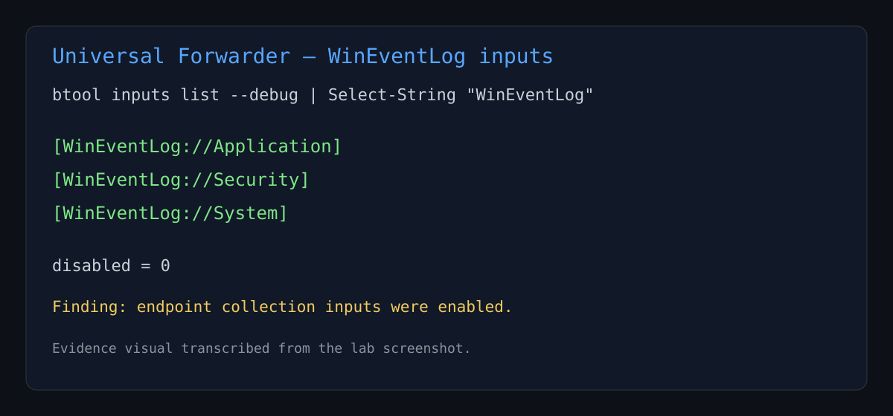
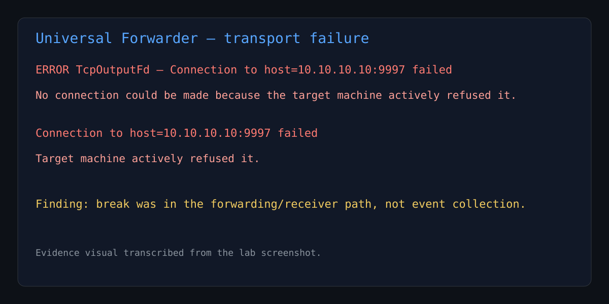
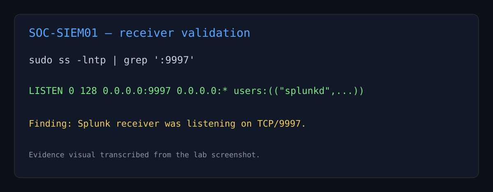
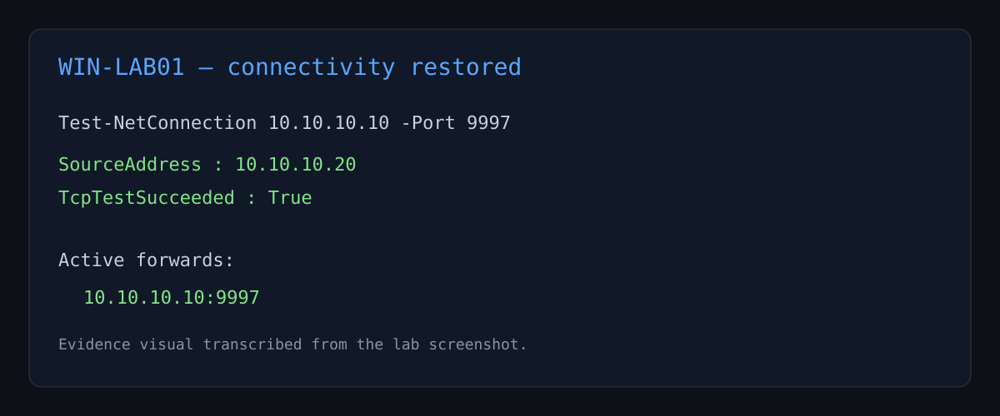
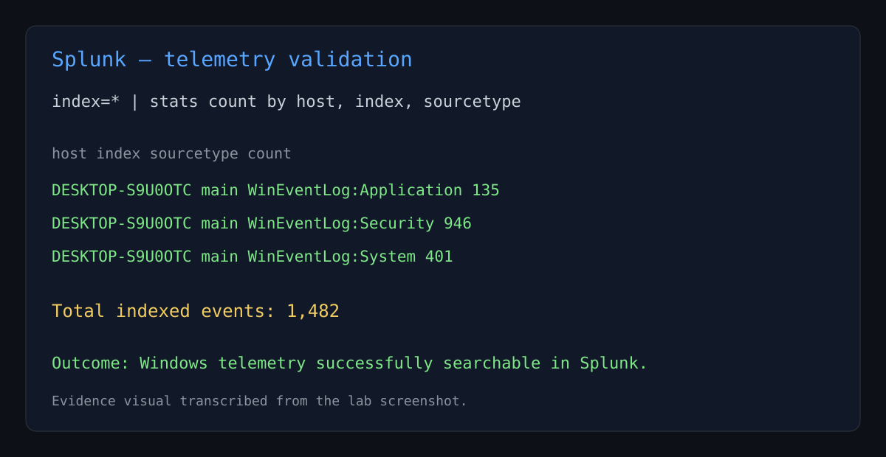

# Splunk Forwarder Troubleshooting Lab

**Portfolio date:** May 2024  
**Lab environment:** Windows 11 endpoint + Ubuntu Splunk Enterprise SIEM  
**Purpose:** Document a real troubleshooting sequence from endpoint telemetry collection through successful ingestion.

> Note: The portfolio date above is part of the project chronology. GitHub commit metadata reflects when this documentation was actually added. The evidence visuals below are transcribed from screenshots captured during the lab session.

## Executive summary

While building a SOC home lab, the Windows 11 endpoint appeared to be connected to the Splunk indexer over TCP/9997, yet no Windows events were visible in Splunk searches.

The issue was resolved by separating the telemetry pipeline into individual layers and validating each one independently:

1. Confirm Windows Event Log inputs were enabled.
2. Inspect the Universal Forwarder logs for transport errors.
3. Confirm Splunk Enterprise was actually listening on TCP/9997.
4. Re-test endpoint-to-indexer connectivity.
5. Confirm the forwarder listed the indexer as an active destination.
6. Search broadly in Splunk without assuming a hostname.
7. Verify Application, Security, and System events were indexed.

The final validation showed **1,482 Windows events** successfully indexed in Splunk.

## Lab architecture

```text
WIN-LAB01 / Windows 11
10.10.10.20
        |
        | Windows Event Logs
        v
Splunk Universal Forwarder
        |
        | TCP 9997
        v
SOC-SIEM01 / Ubuntu
10.10.10.10
        |
        v
Splunk Enterprise
        |
        v
Searchable telemetry
```

## Initial symptom

The Universal Forwarder service was running and had been configured to send data to:

```text
10.10.10.10:9997
```

However, Splunk searches initially returned no Windows events.

A useful lesson was that an apparently healthy port configuration does not prove that events are currently being collected, forwarded, indexed, and searched successfully. Each layer has to be validated separately.

## Step 1 — Validate Windows Event Log inputs

The effective Universal Forwarder configuration showed that Windows Event Log collection was enabled for:

- Application
- Security
- System

Relevant configuration excerpts included:

```text
[WinEventLog://Application]
[WinEventLog://Security]
[WinEventLog://System]
disabled = 0
```

This confirmed that the endpoint collection layer was enabled.



## Step 2 — Inspect the forwarder transport logs

The Universal Forwarder `splunkd.log` showed repeated connection failures to the Splunk indexer:

```text
Connection to host=10.10.10.10:9997 failed
No connection could be made because the target machine actively refused it.
```

This was the key evidence that the problem was not Windows Event Log collection itself. The failure existed between the forwarder and the receiving service.



## Step 3 — Validate the Splunk receiver

On the Ubuntu SIEM, the listening socket was checked with:

```bash
sudo ss -lntp | grep ':9997'
```

Splunk was then confirmed listening on:

```text
0.0.0.0:9997
```



This demonstrates an important troubleshooting distinction:

- A historical forwarder log can show connection failures from an earlier point in time.
- A later server-side socket check can show that the receiver is now healthy.

Both observations can be true.

## Step 4 — Re-test endpoint connectivity

From Windows:

```powershell
Test-NetConnection 10.10.10.10 -Port 9997
```

The result showed:

```text
TcpTestSucceeded : True
```

The forwarder was also checked with:

```powershell
& "C:\Program Files\SplunkUniversalForwarder\bin\splunk.exe" list forward-server
```

The indexer appeared under:

```text
Active forwards:
    10.10.10.10:9997
```

with no inactive destinations.



## Step 5 — Search broadly instead of assuming the hostname

One early search used the conceptual lab name `WIN-LAB01`, but Windows was still reporting its real hostname as:

```text
DESKTOP-S9U0OTC
```

A later search also tested that actual hostname and still returned zero events at that moment, so hostname mismatch was not the only issue.

The most reliable validation was a broad inventory search:

```spl
index=*
| stats count by host, index, sourcetype
```

This avoided assumptions about the host field and showed what Splunk had actually indexed.

## Resolution and validation

After receiver connectivity was healthy, the forwarder delivered the queued Windows telemetry.

Splunk returned:

| host | index | sourcetype | count |
|---|---|---|---:|
| DESKTOP-S9U0OTC | main | WinEventLog:Application | 135 |
| DESKTOP-S9U0OTC | main | WinEventLog:Security | 946 |
| DESKTOP-S9U0OTC | main | WinEventLog:System | 401 |

**Total: 1,482 events**



## Root-cause analysis

The investigation identified multiple independent factors that initially made the telemetry appear unavailable:

- **Historical transport failures:** the Universal Forwarder log contained repeated connection-refused errors for TCP/9997.
- **Search assumptions:** the endpoint was initially referred to as `WIN-LAB01`, while its actual Windows hostname was `DESKTOP-S9U0OTC`.
- **Disk pressure on the SIEM:** Splunk temporarily blocked searches because free disk space dropped below its 5 GB minimum threshold.
- **Timing:** after TCP/9997 became healthy, the forwarder was able to send queued telemetry, after which events appeared in Splunk.

The main operational lesson is that **“no logs visible” is not the same as “no logs are being generated.”**

## SOC troubleshooting method

For similar telemetry issues, validate the pipeline in this order:

```text
1. Source telemetry exists
        |
2. Input/collector is enabled
        |
3. Forwarder/agent service is running
        |
4. Network path is reachable
        |
5. Receiver is listening
        |
6. Forwarding destination is active
        |
7. Events are indexed
        |
8. Search filters match actual fields
```

This prevents unnecessary reinstalls and helps isolate the failing layer quickly.

## Skills demonstrated

- Splunk Universal Forwarder troubleshooting
- Windows Event Log collection
- TCP service validation
- PowerShell connectivity testing
- Splunk SPL investigation
- Log pipeline troubleshooting
- Linux socket inspection with `ss`
- Distinguishing source, transport, indexing, and search-layer failures
- Evidence-driven SOC troubleshooting

## Useful commands

### Windows endpoint

```powershell
Get-Service SplunkForwarder

Test-NetConnection 10.10.10.10 -Port 9997

& "C:\Program Files\SplunkUniversalForwarder\bin\splunk.exe" list forward-server

& "C:\Program Files\SplunkUniversalForwarder\bin\splunk.exe" btool inputs list WinEventLog://Security --debug

Get-WinEvent -LogName Security -MaxEvents 3
```

### Ubuntu Splunk server

```bash
sudo ss -lntp | grep ':9997'
df -h /
```

### Splunk

```spl
index=*
| stats count by host, index, sourcetype
```

## Outcome

The Windows endpoint successfully delivered Application, Security, and System logs through the Universal Forwarder to Splunk Enterprise over TCP/9997, and the events were confirmed searchable in the SIEM.

This troubleshooting sequence is useful portfolio evidence because it demonstrates not only that the lab was built, but that a broken telemetry path was investigated systematically and restored using observable evidence.
