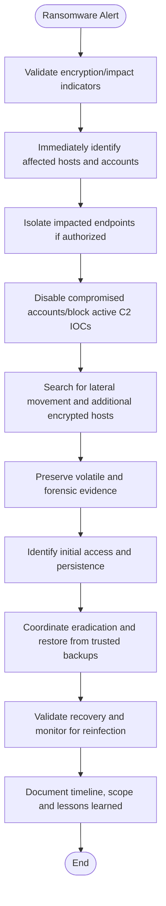

# Ransomware Incident Response Playbook

> **SOC Analyst Portfolio Project** — EDR triage, rapid containment, lateral movement scoping, IOC analysis, recovery coordination.

**Portfolio timeline:** May 2025  
**Series:** SOC Incident Response Playbooks  
**Note:** This is a lab/portfolio playbook. Adapt actions to organizational policy, authorization, evidence-retention rules, and approved tools.

## Investigation Flowchart



## Objectives

- Triage the alert consistently and establish scope.
- Correlate identity, endpoint, network, and security telemetry.
- Separate benign activity from suspicious or confirmed malicious behavior.
- Preserve evidence and document analyst reasoning.
- Apply containment only when authorized and supported by evidence.
- Escalate with a clear timeline, IOCs, affected assets, and actions taken.

## Initial Triage Checklist

1. Record alert source, timestamp, severity, user/account, host/device, and relevant IPs.
2. Establish the investigation time window and preserve original evidence.
3. Validate whether the alert corresponds to expected business activity.
4. Look for successful follow-on activity, related alerts, and repeat indicators.
5. Search across the environment to determine whether the activity is isolated or widespread.
6. Record every containment or remediation action in the case ticket.

## Evidence to Collect

| Category | Examples |
|---|---|
| Identity | Account, authentication result, MFA, source IP, application |
| Endpoint | Hostname, process tree, command line, file hashes, device events |
| Network | Source/destination IP, DNS, domain/URL, proxy/firewall activity |
| Timeline | First seen, last seen, related successful/failed events |
| Context | Asset owner, business purpose, approved change or travel |
| Response | Isolation, blocking, reset/revocation, quarantine, escalation |

## Splunk SPL Example

```spl
index=edr (ransomware OR encryption OR shadowcopy OR vssadmin OR bcdedit)
| stats values(process_name) values(command_line) by host, user
```

Use the query as a starting point and tune field names, indexes, thresholds, and allowlists to the lab or production environment.

## Microsoft Sentinel / Defender KQL Example

```kusto
DeviceProcessEvents
| where ProcessCommandLine has_any ("vssadmin delete shadows","wmic shadowcopy delete","bcdedit")
   or FileName has_any ("vssadmin.exe","wbadmin.exe")
| project Timestamp, DeviceName, AccountName, FileName, ProcessCommandLine
```

Validate the results against other telemetry before taking action. A single query hit should not be treated as proof of compromise.

## Analyst Decision Points

**Benign / expected:** document the evidence that explains the behavior and close according to procedure.

**Suspicious / inconclusive:** preserve evidence, increase monitoring, enrich IOCs, and escalate when the available evidence is insufficient for a confident disposition.

**Confirmed malicious:** contain affected assets or accounts only within authorization, scope the incident across the environment, remediate the root cause, and document the complete timeline.

## Containment & Remediation

Depending on the scenario and organizational authorization:

- Isolate affected endpoints.
- Disable, restrict, or reset compromised accounts.
- Revoke active sessions/tokens.
- Block confirmed malicious domains, IPs, URLs, or hashes.
- Remove malicious files, persistence, rules, or unauthorized privileges.
- Search for additional affected users/devices before declaring containment complete.
- Preserve evidence needed for incident response, legal, HR, or compliance review.

## Incident Ticket Template

```text
Incident Type: Ransomware Incident Response Playbook
Detection Source:
Severity:
Analyst:

Summary:

Affected User(s):
Affected Host(s):
Source/Destination IP:
Relevant Domain/URL:
Hash / Process / Command:

Timeline:
- First observed:
- Last observed:
- Related events:

Analysis:
- Alert validation:
- Correlated telemetry:
- IOC/reputation findings:
- User/business context:
- Scope assessment:

Disposition:
Benign / Suspicious / Malicious

Containment:
- Actions taken:
- Accounts/assets affected:
- Blocks/quarantines/isolation:

Escalation:
- Team/person notified:
- Reason:
- Follow-up required:

Analyst Notes:
Document the evidence supporting the disposition.
```

## MITRE ATT&CK Context

T1486 – Data Encrypted for Impact. Map additional techniques only when they are supported by observed evidence rather than assumed from the alert name.

## Skills Demonstrated

EDR triage, rapid containment, lateral movement scoping, IOC analysis, recovery coordination.

## Safety & Portfolio Disclaimer

This repository is intended for defensive cybersecurity education and portfolio demonstration. Queries use generic example schemas and require adaptation. Do not perform containment, account changes, blocking, or forensic actions in systems you are not authorized to administer.
